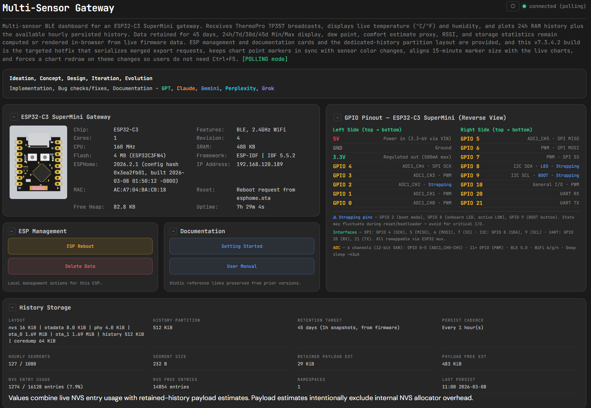

# ESP32-C3 Multi-Sensor BLE Gateway

A standalone BLE-to-WiFi gateway built on the **ESP32-C3 SuperMini**. It passively receives temperature and humidity broadcasts from multiple **ThermoPro TP357** Bluetooth sensors, computes 15-minute rolling averages, retains 24 hours in RAM, persists up to 45 days of hourly history to flash, and serves everything through an embedded HTML dashboard with real-time charts.

No cloud. No database. No Home Assistant required. Just an ESP32, the gateway firmware, and a browser.

> **Current default configuration on `main`: 3 BLE sensors.**
> As of **v7.4.5.0**, the repo supports **1–4 sensors** through a canonical manifest plus generator workflow. See [Docs/configuring-sensors.md](Docs/configuring-sensors.md).

**Total hardware cost: ~$35 USD.**



## What It Does

- Receives BLE advertisements from ThermoPro TP357 sensors
- Current repo default: **3 configured sensors**
- Displays live temperature (°C/°F), humidity, dew point, battery, and RSSI per sensor
- Computes 15-minute rolling averages aligned to wall-clock boundaries
- Keeps 24h of history in RAM and persists up to 45 days of hourly history to a dedicated NVS partition
- Serves an embedded HTML dashboard directly from the ESP32 — no external hosted UI required
- Dashboard supports dark/light mode, collapsible sections, CSV export/import, and **24h / 7d / 30d / 45d** history ranges
- Supports browser or CLI backup/restore of retained history during sensor-count changes
- Accessible on LAN or over the internet via Cloudflare tunnel
- Dashboard HTML/JS is minified before embedding in `dashboard.h` to save flash space

## Quick Start

```bash
# 1. Clone the repo
git clone https://github.com/GCV-Sleeper-Service/ESP32-GW-multi-sensor.git
cd ESP32-GW-multi-sensor

# 2. Create your secrets file
cp secrets/secrets-example.yaml secrets/secrets.yaml
# Edit secrets/secrets.yaml with your WiFi credentials and management password

# 3. Symlink secrets for ESPHome (Linux/LXC)
ln -s ../secrets/secrets.yaml firmware/secrets.yaml

# 4. Make helper scripts executable
chmod +x scripts/*.sh scripts/*.py

# 5. Review / change configured sensors (canonical source: config/sensors.json)
python3 scripts/change_sensor_number.py

# 6. Validate generated files
bash ./scripts/preflight.sh

# 7. Compile and flash
esphome compile firmware/esp32-c3-multi-sensor.yaml
esphome run firmware/esp32-c3-multi-sensor.yaml
```

Open `http://<esp-ip>/dashboard.html` in your browser.

## Sensor Configuration Workflow

The repo no longer expects you to edit four separate files by hand.

Primary files and scripts:

- `config/sensors.json` — canonical sensor manifest
- `scripts/change_sensor_number.py` — interactive add/remove flow
- `scripts/render_sensor_config.py` — regenerates generated sections from the manifest
- `scripts/history_backup.py` — CLI backup/restore helper for retained history

When sensor count changes, retained history layout changes too. Back up retained history first, then flash the new firmware, delete old retained history, and restore the backup.

Backup example:

```bash
python3 scripts/history_backup.py export \
  --host http://192.168.120.189 \
  --output backup-before-sensor-change.csv
```

Restore example:

```bash
python3 scripts/history_backup.py import \
  --host http://192.168.120.189 \
  --input backup-before-sensor-change.csv \
  --username <user> \
  --password <pass>
```

## Repository Layout

```text
ESP32-GW-multi-sensor/
  config/
    sensors.json                   Canonical sensor manifest
  dashboard/
    dashboard.html                 Editable dashboard source
    dashboard.js                   Dashboard JavaScript
    dashboard.h                    Generated embedded payload (committed)
    sensor_history_multi.h         Backend: history, persistence, API endpoints
  firmware/
    esp32-c3-multi-sensor.yaml     ESPHome firmware configuration
  partitions/
    esp32-c3-multi-partitions.csv  Custom partition table (512 KiB history)
  scripts/
    change_sensor_number.py        Interactive manifest editor
    render_sensor_config.py        Generator for sensor-dependent files
    history_backup.py              CLI export/import helper
    preflight.sh                   Repo validation and smoke checks
  tests/
    fixtures/                      Mock API data and generated variants
    mock-server/                   Local HTTP mock for Playwright
  Docs/                            Project documentation
  VERSION                          Current version number
```

## API Endpoints

| Endpoint | Method | Auth | Purpose |
|----------|--------|------|---------|
| `/dashboard.html` | GET | No | Embedded dashboard |
| `/sensors.json` | GET | No | Sensor manifest |
| `/history/{id}/temp` | GET | No | Temperature history stream |
| `/history/{id}/hum` | GET | No | Humidity history stream |
| `/api/status` | GET | No | Version, uptime, sensor health, heap |
| `/api/storage-stats` | GET | No | Partition and retention statistics |
| `/api/reboot` | POST | Basic | Reboot the ESP |
| `/api/delete-data` | POST | Basic | Erase persisted history |
| `/api/import/begin` | POST | Basic | Start multi-sensor import (erases history) |
| `/api/import/begin/single/<id>` | POST | Basic | Start single-sensor merge import |
| `/api/import/d/<data>` | POST | Basic | Add import data points |
| `/api/import/w/<data>` | POST | Basic | Add data points + write segment |
| `/api/import/finish` | POST | Basic | Finalize import, restore RAM |

## Current Version

**v7.4.5.0** — canonical sensor manifest, interactive sensor-count automation, CLI history backup/restore, and manifest-aware preflight.

See [Docs/changelog.md](Docs/changelog.md) for released history.
