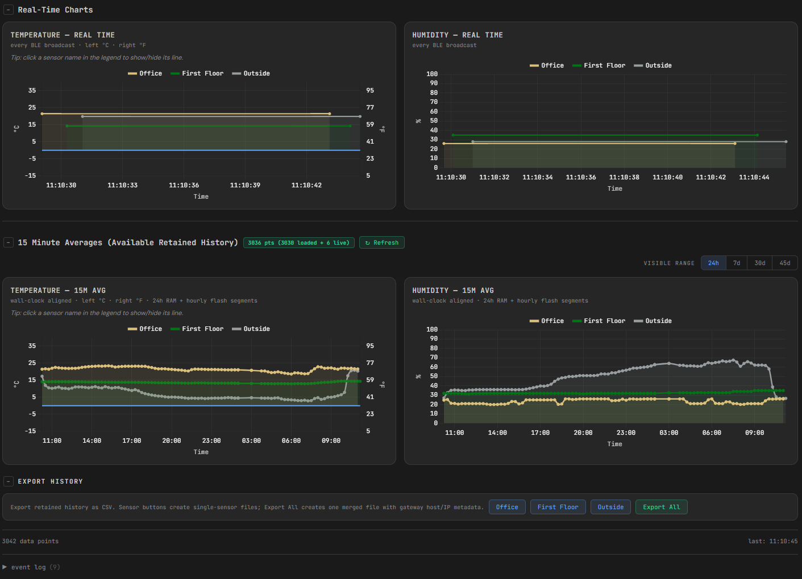
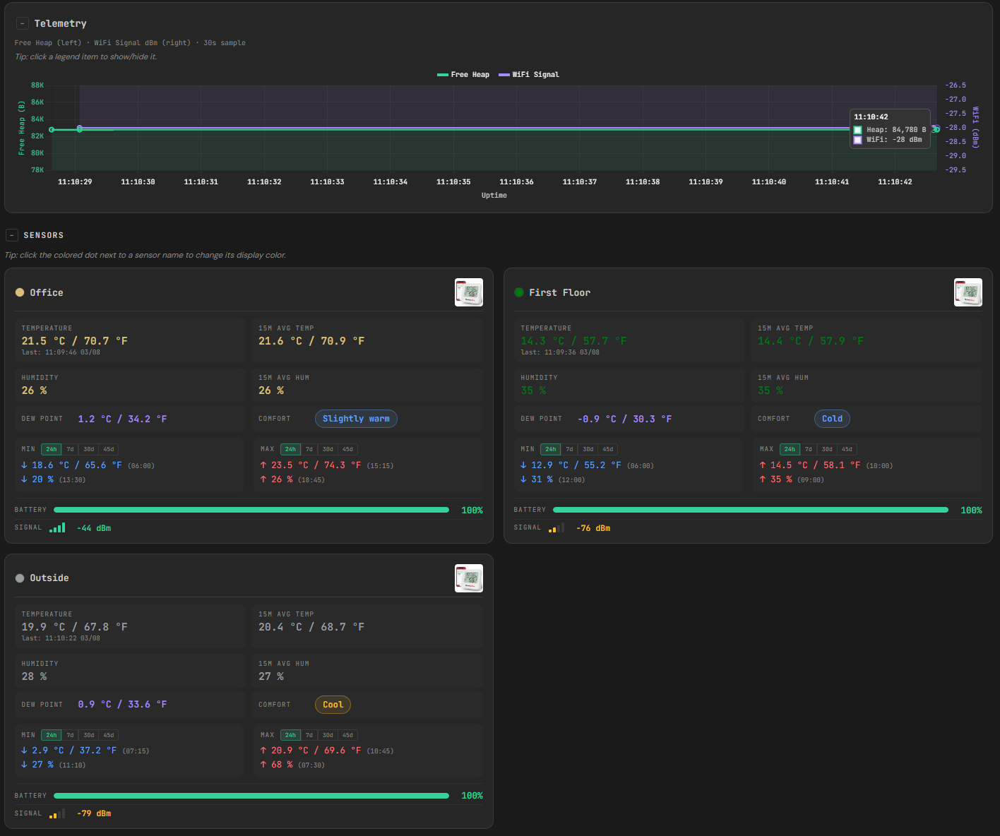

# ESP32-C3 Multi-Sensor BLE Gateway

A standalone BLE-to-WiFi gateway built on the **ESP32-C3 SuperMini**. It passively receives temperature and humidity broadcasts from multiple **ThermoPro TP357** Bluetooth sensors, computes 15-minute rolling averages, retains 24 hours in RAM, persists up to 45 days of hourly history to flash, and serves everything through an embedded HTML dashboard with real-time charts.

No cloud. No database. No Home Assistant required. Just an ESP32, up to 4 BLE sensors, and a browser.

**Total hardware cost: ~$35 USD.**


## What It Does

- Receives BLE advertisements from up to 4 ThermoPro TP357 sensors
- Displays live temperature (°C/°F), humidity, dew point, battery, and RSSI per sensor
- Computes 15-minute rolling averages aligned to wall-clock boundaries
- Keeps 24h of history in RAM, persists up to 45 days of hourly history to a dedicated NVS partition
- Serves an embedded HTML dashboard directly from the ESP32 — no external files needed
- Dashboard supports dark/light mode, collapsible sections, CSV export/import, and 24h/7d/30d/45d min/max selectors
- Accessible on LAN or over the internet via Cloudflare tunnel
- Dashboard HTML/JS minified before embedding (~40KB flash savings via html-minifier-terser)





## Hardware

| Item | Qty | ~Price | Notes |
|------|-----|--------|-------|
| ESP32-C3 SuperMini | 1 | $3–5 | Amazon, AliExpress |
| ThermoPro TP357 | 1–4 | $9–10 each | BLE temperature/humidity |
| USB-C cable + adapter | 1 | $3 | For initial flash only |

No breadboard, no wiring, no soldering. Each TP357 runs on a single AAA battery lasting 6–9 months.

## Quick Start

```bash
# 1. Clone the repo
git clone https://github.com/GCV-Sleeper-Service/ESP32-GW-multi-sensor.git
cd ESP32-GW-multi-sensor

# 2. Create your secrets file
cp secrets/secrets-example.yaml secrets/secrets.yaml
# Edit secrets/secrets.yaml with your WiFi credentials and management password

# 3. Symlink secrets for ESPHome (Linux/LXC)
ln -s ../secrets/secrets.yaml firmware/secrets.yaml

# 4. Edit the YAML with your sensor MAC addresses
# See the Configuration section in Docs/architecture.md

# 5. Compile and flash
esphome compile firmware/esp32-c3-multi-sensor.yaml
esphome run firmware/esp32-c3-multi-sensor.yaml
```

Open `http://<esp-ip>/dashboard.html` in your browser.

## Repository Layout

```
ESP32-GW-multi-sensor/
  .github/workflows/ci.yml     CI: preflight + compile
  dashboard/
    dashboard.html              Editable dashboard source
    dashboard.js                Dashboard JavaScript
    dashboard.h                 Generated embedded payload (committed)
    sensor_history_multi.h      Backend: history, persistence, API endpoints
  firmware/
    esp32-c3-multi-sensor.yaml  ESPHome firmware configuration
  partitions/
    esp32-c3-multi-partitions.csv   Custom partition table (512 KiB history)
  scripts/                      Helper scripts (preflight, minify, compile, deploy)
  secrets/                      secrets-example.yaml (real secrets gitignored)
  Images/                       Dashboard screenshots
  Docs/                         Project documentation
  VERSION                       Current version number
```

## API Endpoints

| Endpoint | Method | Auth | Purpose |
|----------|--------|------|---------|
| `/dashboard.html` | GET | No | Embedded dashboard |
| `/sensors.json` | GET | No | Sensor manifest |
| `/history/{id}/temp` | GET | No | Temperature history stream |
| `/history/{id}/hum` | GET | No | Humidity history stream |
| `/api/status` | GET | No | Version, uptime, sensor health, heap |
| `/api/storage-stats` | GET | No | Partition and retention statistics |
| `/api/reboot` | POST | Basic | Reboot the ESP |
| `/api/delete-data` | POST | Basic | Erase persisted history |
| `/api/import/begin` | POST | Basic | Start multi-sensor import (erases history) |
| `/api/import/begin/single/<id>` | POST | Basic | Start single-sensor merge import |
| `/api/import/d/<data>` | POST | Basic | Add import data points |
| `/api/import/w/<data>` | POST | Basic | Add data points + write segment |
| `/api/import/finish` | POST | Basic | Finalize import, restore RAM |

## Development

The repo uses a GitHub-first workflow with branch protection on `main`:

1. Create a feature branch → make changes → run `./scripts/test-local.sh`
2. Push and open a PR → CI validates preflight + compile automatically
3. Flash and test on the real device
4. Merge after CI green + device validation

See [Docs/development-pipeline.md](Docs/development-pipeline.md) for the full process.

## Current Version

**v7.4.1.0** — Dashboard minification pipeline (html-minifier-terser, ~40KB flash savings). See [Docs/changelog.md](Docs/changelog.md) for history.

## Documentation

| Document | Purpose |
|----------|---------|
| [Fresh Start Handoff](Docs/esp32-gateway-fresh-start-handoff.md) | Complete project context for resuming development |
| [Development Pipeline](Docs/development-pipeline.md) | Workflow, process, CI, and next steps |
| [Architecture](Docs/architecture.md) | Software design, data flows, retention model |
| [Changelog](Docs/changelog.md) | Version history with what changed and why |
| [Build History](Docs/build-history.md) | Curated ledger of accepted builds |
| [Bugs & Lessons Learned](Docs/bugs-and-lessons-learned.md) | Accumulated fixes and technical lessons |
| [Future Plans](Docs/future-plans.md) | Roadmap and feature assessment |
| [Device Test Report Template](Docs/device-test-report-template.md) | Post-flash testing checklist |

## License

MIT
